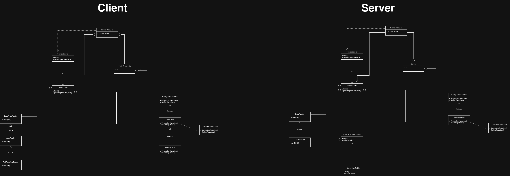

# DBUS Configuration Manager


## Введение
D-Bus Configuration Manager — это сервер и клиент на C++ для управления конфигурацией через D-Bus. Сервер регистрирует сервис `com.system.configurationManager` и создаёт объекты на основе конфигурационных файлов в `~/data/`. Клиент взаимодействует с этими объектами, отслеживает изменения конфигурации и выполняет заданное поведение (например, периодический вывод сообщений). Проект поддерживает многопоточность, потокобезопасность и расширяемость для добавления новых типов объектов.

## Зависимости
- C++20 или выше
- `sdbus-c++`: Библиотека для работы с D-Bus, версия 2.1.0-1
- `boost`: Для парсинга JSON (модуль `boost::json`)
- `meson`: Система сборки
- `ninja`: Инструмент для выполнения сборки
- `cmake`, `g++`, `pkg-config`: Для сборки `sdbus-c++`


## Сборка проекта 
1. ``` sudo apt-get install build-essential meson ninja-build libboost-all-dev libsdbus-c++-dev cmake g++ pkg-config```

Если хотите расширять проект(об этом подробнее ниже) стоит склонить официальный репозиторий sdbus-c++


``` $ git clone https://github.com/Kistler-Group/sdbus-cpp.git ```

затем выполнить следующие шаги

``` $ cd sdbus-cpp```

``` $ cd build ```

``` $  cmake.. -DSDBUSCPP_BUILD_CODEGEN=ON ```

``` $ make ```

```$ sudo make install ```


в результате чего вам будет доступна утилита **sdbus-c++-xml2cpp**


2. После установки всех необходимых зависимостей следует склонировать текущий репозиторий

``` $ git clone https://github.com/skitcc/dbus-service.git ```

затем 

``` $ cd dbus-service ```

``` $ meson setup build ```

``` $ cd build && meson compile```


В результате этих действий в папке build окажутся два исполняемых файла.
1. daemon.exe - Сервер, регистрирующий D-Bus сервис и объекты.
2. client.exe - Клиент, взаимодействующий с объектами и выполняющий заданное поведение.

## Пример работы программы

Для наглядности созданим в папке ~/data единственную конфигурацию, назовем ее **timeout.conf** и содержать этот файл будет следующее

```
--META--
Timeout
--------
Timeout int:2
TimeoutPhrase string:mama
```

### Краткое описание файла конфигурации
```
--META--
Timeout
--------
```

Секция метаинформации, Timout - тип создаваемого dbus обьекта (под типом подразумевается поведение клиента)

```
Timeout int:2
TimeoutPhrase string:mama
```

Секция атрибутов обьекта с которыми будет взаимодействовать клиент, перед значением пишется тип значения: int, string, etc


Собираем наш проект и получаем два исполняемый файла: daemon.exe - сервиc,
client.exe - клиент


запускаем daemon.exe
видим следующий вывод
```
Adding object: {"ObjectPath":"/com/system/configurationManager/Application/timeout_conf","ObjectType":"Timeout"}
Service is running...
```

означающий что сервис успешно нашел конфигурацию и привязал обьект к заданному сервису

чтобы проверить корректность можно отправить запрос на сервер и получить интроспективные данные с помощью команды

```bash
gdbus introspect --session --dest com.system.configurationManager -o /com/system/configurationManager/Application/timeout_conf
```

```bash
$ gdbus introspect --session --dest com.system.configurationManager -o /com/system/configurationManager/Application/timeout_conf
node /com/system/configurationManager/Application/timeout_conf {
  interface org.freedesktop.DBus.Peer {
    methods:
      Ping();
      GetMachineId(out s machine_uuid);
    signals:
    properties:
  };
  interface org.freedesktop.DBus.Introspectable {
    methods:
      Introspect(out s xml_data);
    signals:
    properties:
  };
  interface org.freedesktop.DBus.Properties {
    methods:
      Get(in  s interface_name,
          in  s property_name,
          out v value);
      GetAll(in  s interface_name,
             out a{sv} props);
      Set(in  s interface_name,
          in  s property_name,
          in  v value);
    signals:
      PropertiesChanged(s interface_name,
                        a{sv} changed_properties,
                        as invalidated_properties);
    properties:
  };
  interface com.system.configurationManager.Application.Configuration {
    methods:
      ChangeConfiguration(in  s key,
                          in  v value);
      GetConfiguration(out a{sv} configuration);
    signals:
      ConfigurationChanged(a{sv} configuration);
    properties:
  };
};
```

как мы видим обьект успешно привязан и предоставляет желаемый интерфейс

теперь запустим клиент, и видим что каждые timeout(2 секунды) выводится фраза mama, теперь попробуем отправить запрос на смену фразы, например с mama на papa

Отправляем запрос

``` $ gdbus call -e -d com.system.configurationManager \
  -o /com/system/configurationManager/Application/timeout_conf \
  -m com.system.configurationManager.Application.Configuration.ChangeConfiguration \
  "TimeoutPhrase" "<'papa'>"
  ```

и видим как фраза изменилась

```
$ ./client.exe
mama
mama
mama
mama
mama
mama
mama
mama
mama
mama
papa
papa
papa
papa
```


## Пример работы программы 2

Проект написан таким образом что может поддерживать сразу несколько обьектов на сервисе и работу с ним через единого клинта, вот например добавим к уже существующей конфигурации timeout.conf второй конфигурационный файл timeout1.conf со следующим содержанием
```
--META--
Timeout
--------
Timeout int:5
TimeoutPhrase string:papa
```
(каждые 5 секунд должна выводиться фраза papa)

итак запустим наш сервис
видим следующий вывод
```
Adding object: {"ObjectPath":"/com/system/configurationManager/Application/timeout1_conf","ObjectType":"Timeout"}
Adding object: {"ObjectPath":"/com/system/configurationManager/Application/timeout_conf","ObjectType":"Timeout"}
Service is running...
```

Вывод говорит о том что зарегестировано 2 обьекта
Запустим клиент
```
$ ./client.exe
papa
mama
mama
mama
papa
mama
mama
papa
mama
mama
mama
papa
mama
mama
papa
```
и видим что вывод действительно чередуется и каждые 2 секунды выводится фраза "mama" а каждые 5 секунд "papa"

для проверки изменим фразу mama на mother а папа на father, выполняем следующие команды

``` 
$ gdbus call -e -d com.system.configurationManager \
  -o /com/system/configurationManager/Application/timeout_conf \
  -m com.system.configurationManager.Application.Configuration.ChangeConfiguration \
  "TimeoutPhrase" "<'mother'>"
```
```
$ gdbus call -e -d com.system.configurationManager \
  -o /com/system/configurationManager/Application/timeout1_conf \
  -m com.system.configurationManager.Application.Configuration.ChangeConfiguration \
  "TimeoutPhrase" "<'father'>"
```

и видим соответствующий вывод

```
$ ./client.exe
mama
papa
mama
mama
papa
mama
mama
papa
mama
mama
mother
papa
mother
mother
papa
mother
mother
mother
papa
mother
mother
papa
mother
mother
mother
father
mother
```

## Дополнительная информация по расширению проекта

Проект спроектирован таким образом, чтобы в дальнейшем его можно было расширять без перестройки текущего содержимого, в конфигурационном файле вы можете создать любую конфигурацию, к примеру подсчет следующего числа фибоначчи каждые 2 секунды

```
--META--
Fibo
--------
Timeout int:2
```

Предположим вот так, все что вам нужно дальше это унаследоваться от BaseProxy и написать метод 

```cpp
    virtual void specificBehaviour() = 0;
```

под свою нужду, так же добавить соответствующие типы в перечисления.

Если же вы координально хотите изменить интерфейс и сделать не конфигурационный сервис, то генерируете сервисный и прокси адаптер с помощью утилиты **sdbus-c++-xml2cpp** наследуетесь через систему интерфейсов sdbus-c++ в BaseObject, аналогично в прокси классах

Ниже предоставлена диаграмма классов для понимания(также файл drawio находится в папке uml)
